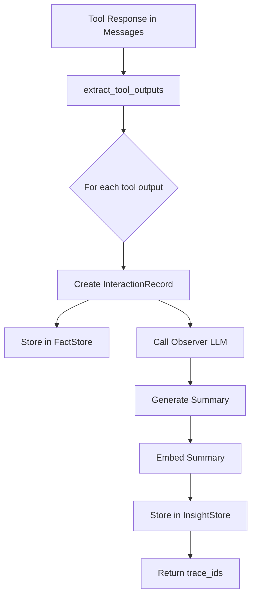
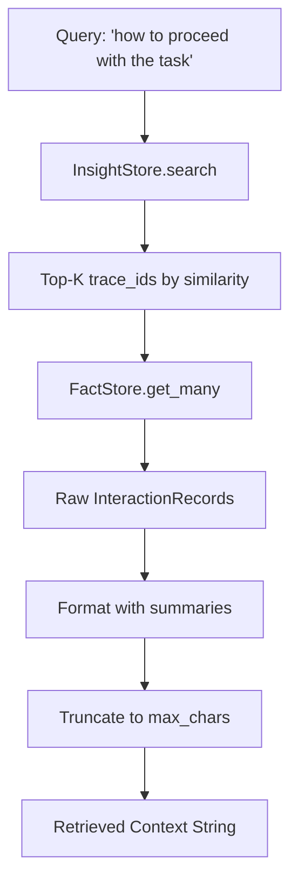
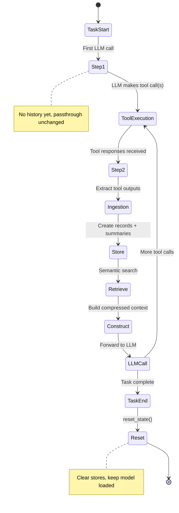

# Memory Bank Strategy

A vector-based retrieval system for managing agent interaction history in LLM function-calling scenarios. It implements a **dual-store architecture** that decouples reasoning (semantic summaries) from precision (raw data), enabling efficient context compression while preserving ground truth information.

## Table of Contents

- [Architecture Overview](#architecture-overview)
- [Components](#components)
- [Data Flow](#data-flow)
- [Configuration](#configuration)
- [Memory Lifecycle](#memory-lifecycle)
- [Context Construction](#context-construction)
- [Logging](#logging)

---

## Architecture Overview

The Memory Bank uses a **dual-store pattern** to balance semantic reasoning and data precision:

```text
                         MEMORY BANK ARCHITECTURE

    ┌────────────────────────────────────────────────────────────┐
    │                      Memory Bank                           │
    │                                                            │
    │   ┌──────────────────┐      ┌──────────────────────────┐   │
    │   │    Fact Store    │      │      Insight Store       │   │
    │   │   (Precision)    │      │       (Reasoning)        │   │
    │   │                  │      │                          │   │
    │   │  Key-Value Dict  │      │  Vector Store + BGE      │   │
    │   │  trace_id → raw  │      │  Embeddings              │   │
    │   └────────┬─────────┘      └────────────┬─────────────┘   │
    │            │                             │                 │
    │            │         trace_id            │                 │
    │            └──────────────┬──────────────┘                 │
    │                           │                                │
    └───────────────────────────┼────────────────────────────────┘
                                │
                                ▼
                       Retrieved Context
```

**Why Dual-Store?**

|         Store     | Purpose                                   | Lookup Method         |
|-------------------|-------------------------------------------|-----------------------|
| **FactStore**     | Preserve raw tool outputs (ground truth)  | O(1) by `trace_id`    |
| **InsightStore**  | Enable semantic search over summaries     | Cosine similarity     |

The `trace_id` (UUID) links records across both stores, allowing semantic search to find relevant interactions, then fetch the precise raw data.

---

## Components

### File Structure

```bash
src/strategies/memory_bank/
├── __init__.py              # Exports MemoryBankState, apply_memory_bank_strategy
├── models.py                # InteractionRecord dataclass
├── fact_store.py            # Key-value store for raw data
├── insight_store.py         # Vector store for semantic search
├── observer.py              # LLM summarization of tool outputs
├── observer.prompt.md       # Prompt template for Observer
├── ingestion.py             # Pipeline: tool output → dual-store
├── retrieval.py             # Semantic search + formatting
└── memory_bank_strategy.py  # Main orchestration
```

### InteractionRecord

The fundamental data unit representing a single tool interaction:

```python
@dataclass
class InteractionRecord:
    trace_id: str           # UUID - links FactStore ↔ InsightStore
    step_id: int            # Task sequence position
    tool_name: str          # Which tool was called
    raw_input: Dict         # Arguments passed to tool
    raw_output: Dict        # Response from tool (ground truth)
    timestamp: float        # Unix timestamp
```

**Factory method** auto-generates `trace_id` and `timestamp`:

```python
record = InteractionRecord.create(
    step_id=1,
    tool_name="search_api",
    raw_input={"query": "hotels"},
    raw_output={"results": [...]}
)
```

### FactStore

In-memory key-value store providing O(1) lookup by `trace_id`.

| Method                | Description                                    |
|-----------------------|------------------------------------------------|
| `store(record)`       | Store an InteractionRecord                     |
| `get(trace_id)`       | Retrieve single record (or None)               |
| `get_many(trace_ids)` | Batch retrieve, preserves order, skips missing |
| `clear()`             | Remove all records                             |
| `size()`              | Return record count                            |

### InsightStore

Vector store using `FlagEmbedding` (`BAAI/bge-small-en-v1.5` by default) for semantic search.

```text
              InsightStore Internal Structure

    ┌─────────────────────────────────────────────┐
    │  _entries: List[Dict]                       │
    │                                             │
    │  ┌─────────────────────────────────────┐    │
    │  │ {                                   │    │
    │  │   trace_id: "abc-123",              │    │
    │  │   summary: "Found 5 hotels...",     │    │
    │  │   embedding: [0.12, 0.45, ...]      │    │
    │  │ }                                   │    │
    │  └─────────────────────────────────────┘    │
    │  ┌─────────────────────────────────────┐    │
    │  │ { trace_id: "def-456", ... }        │    │
    │  └─────────────────────────────────────┘    │
    │  ...                                        │
    └─────────────────────────────────────────────┘
```

| Method                   | Description                              |
|--------------------------|------------------------------------------|
| `add(trace_id, summary)` | Embed summary, store with trace_id link  |
| `search(query, top_k=3)` | Return top-K most similar trace_ids      |
| `get_summary(trace_id)`  | Retrieve summary for a specific trace_id |
| `clear()`                | Remove all entries                       |

**Similarity**: Cosine similarity via normalized dot product.

### Observer

LLM component that generates natural language summaries of tool outputs. Uses a dedicated model (configurable, default `gpt-4-1-mini`).

```python
def observe_tool_output(
    user_query: str,      # Original task context
    tool_name: str,       # Which tool was called
    raw_output: Dict,     # Tool's JSON response
    llm_client: Any,      # LLM with generate_plain() method
    model: str,           # Model identifier
) -> str:                 # Natural language summary
```

**Prompt strategy** (from `observer.prompt.md`):

- Summarize what was achieved
- Highlight key entities (IDs, coordinates, names, status codes)
- Keep under 200 words
- Preserve identifiers that may be referenced later

**Safety**: Truncates raw output at 10,000 characters before sending to LLM.

---

## Data Flow

### Ingestion Pipeline



``extract_tool_outputs`` parses messages to find:

1. Last assistant message with `tool_calls`
2. Maps `tool_call_id` → `(tool_name, raw_input)`
3. Collects subsequent tool response messages
4. Returns list of `(tool_name, raw_input, raw_output)` tuples

Handles parallel tool calls (multiple tools in single assistant message) by creating separate records for each.

### Retrieval Pipeline



**Output format**:

```markdown
[RETRIEVED RECORD 1]
Summary: Found 5 hotels in downtown area with prices ranging from $120-$350/night
Raw Data: {"results": [{"id": "htl-001", "name": "Grand Hotel", ...}]}
-------------------
[RETRIEVED RECORD 2]
Summary: ...
```

---

## Configuration

### config.toml

```toml
[memory_strategies.memory_bank]
type = "memory_bank"
observer_model = "gpt-4-1-mini"             # Model for summarizing tool outputs
embedding_model = "BAAI/bge-small-en-v1.5"  # Model for vector embeddings
top_k = 3                                   # Number of past interactions to retrieve
max_chars_per_record = 2000                 # Max characters per stored record
```

### Parameters

| Parameter              | Default                  | Description                                      |
|------------------------|--------------------------|--------------------------------------------------|
| `observer_model`       | `gpt-4-1-mini`           | LLM for generating summaries                     |
| `embedding_model`      | `BAAI/bge-small-en-v1.5` | FlagEmbedding model for vectors                  |
| `top_k`                | `3`                      | Number of relevant past interactions to retrieve |
| `max_chars_per_record` | `2000`                   | Truncation limit for raw data in context         |

---

## Memory Lifecycle



### State Management

**MemoryBankState** persists across steps within a task (epiphermal):

```python
@dataclass
class MemoryBankState:
    fact_store: FactStore
    insight_store: Optional[InsightStore]
    step_count: int
    _embedding_model: Optional[Any]  # Kept loaded for reuse
```

| Operation          | Behavior                                               |
|--------------------|--------------------------------------------------------|
| **Step increment** | `step_count += 1` each strategy call                   |
| **Model loading**  | Lazy on first use, kept loaded thereafter              |
| **Task reset**     | Clears both stores, resets step_count, preserves model |

---

## Context Construction

The strategy constructs a compressed context window:

```text
┌─────────────────────────────────────────────────────────────┐
│ 1. USER MESSAGE (Anchor)                                    │
│    Original task/query from user                            │
├─────────────────────────────────────────────────────────────┤
│ 2. SYSTEM MESSAGE (Retrieved Context)                       │
│    "## Retrieved Context from Previous Steps"               │
│    [RETRIEVED RECORD 1]                                     │
│    Summary: ...                                             │
│    Raw Data: ...                                            │
│    -------------------                                      │
│    [RETRIEVED RECORD 2]                                     │
│    ...                                                      │
├─────────────────────────────────────────────────────────────┤
│ 3. LAST TOOL INTERACTION                                    │
│    Assistant message with tool_calls                        │
│    Tool response message(s)                                 │
└─────────────────────────────────────────────────────────────┘
```

**Key design decisions**:

1. **Fixed retrieval query**: Uses `"how to proceed with the task"` for all searches
   - Task-agnostic query that finds relevant next-step context
2. **Anchoring**: Always includes original user query for task grounding
3. **Recency**: Always includes last tool interaction for immediate context
4. **Compression**: Middle history replaced by top-K semantic retrieval

---

## Logging

Uses the project's centralized logger (`src/utils/logger.py`).

### Logger Names

| Logger               | Purpose                     |
|----------------------|-----------------------------|
| `MemoryBankStrategy` | Main strategy orchestration |
| `Observer`           | Tool output summarization   |
| `Ingestion`          | Ingestion pipeline          |
| `Retrieval`          | Retrieval operations        |
| `InsightStore`       | Vector store operations     |

### Log Levels

| Level     | Information                                                 |
|-----------|-------------------------------------------------------------|
| `DEBUG`   | Step counts, ingestion counts, context construction details |
| `INFO`    | Model loading events                                        |
| `WARNING` | Empty Observer responses                                    |

### Example Log Output

```text
INFO  - MemoryBankStrategy - Loading embedding model: BAAI/bge-small-en-v1.5
DEBUG - MemoryBankStrategy - Memory Bank Strategy - Step 3
DEBUG - Ingestion - Ingested tool 'search_api' -> trace_id=a1b2c3d4...
DEBUG - MemoryBankStrategy - Added 3 retrieved records to context
DEBUG - MemoryBankStrategy - Context constructed: 5 messages, 1234 tokens
DEBUG - MemoryBankStrategy - MemoryBankState reset
```

---

## Integration

### With MemoryProcessor

```python
# In src/memory_processing.py
class MemoryProcessor:
    def _apply_memory_bank(self, messages, token_count, settings, llm_client):
        if self._memory_bank_state is None:
            self._memory_bank_state = MemoryBankState()  # Lazy init
        return apply_memory_bank_strategy(
            messages, llm_client, settings, self._memory_bank_state
        )
```

**Behavior**:

- Memory Bank runs **every step** (not gated by `compact_threshold`)
- State lazily initialized on first use
- State persists across steps within a task
- State reset between tasks via `reset_state()`

### With LLMOrchestrator

The orchestrator passes itself as the LLM client, enabling the Observer to call back for summarization:

```python
compressed_view, _ = self.memory_processor.apply_strategy(
    input_messages,
    self.active_memory_key,
    input_token_count=input_token_count,
    llm_client=self,  # Orchestrator as LLM client
)
```

---

## Edge Cases

| Case                          | Handling                                                      |
|-------------------------------|---------------------------------------------------------------|
| First step (no history)       | Passthrough unchanged                                         |
| Missing trace_ids             | `get_many` skips missing, returns found                       |
| Large tool outputs            | Truncated at 10k chars (Observer) and `max_chars` (retrieval) |
| Parallel tool calls           | Each call gets separate record and Observer call              |
| Invalid JSON in tool response | Stored as `{"_raw": content_string}`                          |
| Empty LLM response            | Fallback summary generated                                    |

---

## Dependencies

### External

- `FlagEmbedding` - Vector embeddings (`BAAI/bge-small-en-v1.5`)
- `numpy` - Similarity computation
- `tiktoken` - Token counting

### Internal

- `src/utils/logger.py` - Centralized logging
- `src/utils/token_count.py` - Token counting
- `src/utils/split_trace.py` - Message parsing utilities
- `src/utils/llm_helpers.py` - LLM response extraction
